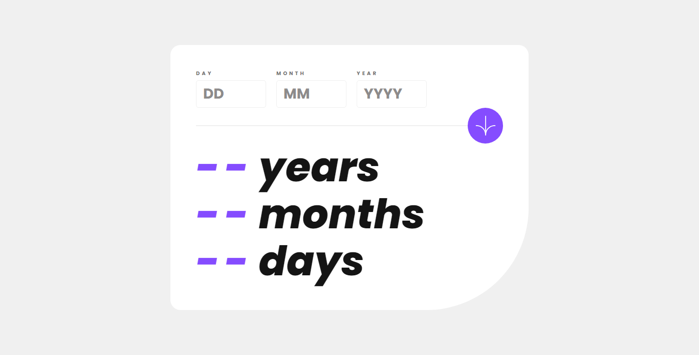
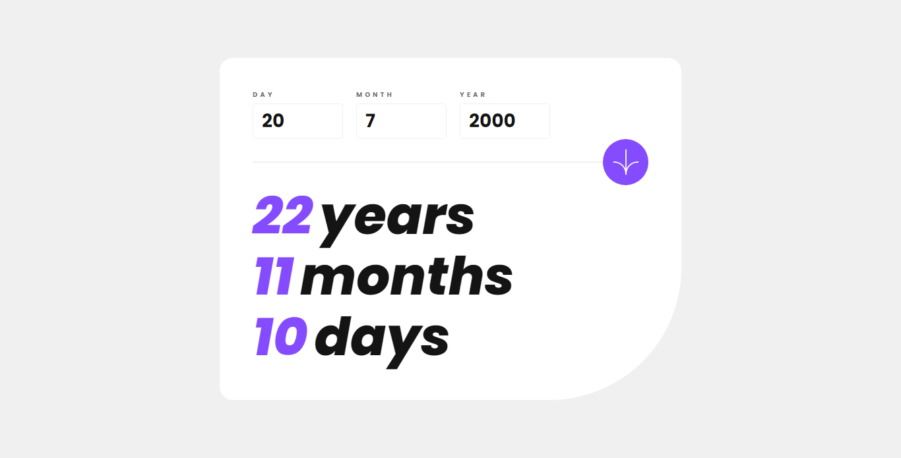
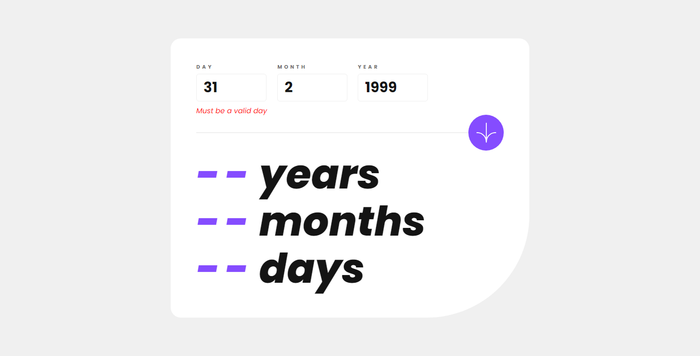

## Overview

I developed this application with the purpose of calculating the user's current age in a simple and accurate way by entering the day, month, and year of birth. The application will provide the user's current age in years, months, and days.

This project arises as an opportunity to practice and train in the use of HTML, CSS, and JavaScript languages, in order to expand my knowledge and skills in web development

### The challenge

Users should be able to:

- View an age in years, months, and days after submitting a valid date through the form
- Receive validation errors if:
  - Any field is empty when the form is submitted
  - The day number is not between 1-31
  - The month number is not between 1-12
  - The year is in the future
  - The date is invalid e.g. 31/04/1991 (there are 30 days in April)
- View the optimal layout for the interface depending on their device's screen size
- See hover and focus states for all interactive elements on the page
- **Bonus**: See the age numbers animate to their final number when the form is submitted

### Screenshot

### Links

- Web Site URL: (https://nicolasesc10.github.io/Age-calculator-app/)

## My process

I started by developing this application using my previous knowledge of HTML and completed the page design with CSS. The most challenging part for me was the implementation of JavaScript, as I wanted to use it as an opportunity to train and familiarize myself with the language. I encountered difficulties when trying to calculate the days, months, and years, as well as making the function aware of the current date at all times. However, after researching, I discovered that JavaScript already had a built-in function to detect the current date of the device used or accessed through the web application.

Once I made the program functional, I realized the need to set limits, as it allowed me to enter incorrect dates such as a birth year in the future (e.g., 2099) or a date like 2/31/2000, which is invalid because February doesn't have 31 days. To address this, I implemented error messages indicating to the user that the entered date was invalid. However, it was a challenge to determine when and where to display these error messages and how to guide the user in correcting the errors.

After solving this problem and making the necessary improvements, I completed the program. It now displays the expected results when a valid date is entered and shows intuitive error messages when an invalid date is entered.

### Built with

- Semantic HTML5 markup
- CSS custom properties
- Flexbox
- CSS Grid
- Mobile-first workflow
- JavaScript

### Continued development

I still have pending tasks to make the application mobile-responsive and ensure that all implemented functions and features work correctly across different browsers. Currently, the application is only compatible with the Chrome browser.

## Author

- Github - (https://github.com/NicolasEsc10)
- Twitter - (https://twitter.com/Nicolas_Esc10)
- Linkedin - (https://www.linkedin.com/in/nicolas-esc10/)
